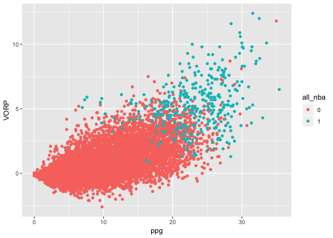

Data Science Challenge: Predict the All-NBA team
================
2016-08-25

Introduction
------------

This project will work with historical year end NBA season stats to try and predict who will make the All-NBA team. Once our model is finalized, we will then apply it to current (partial-season) data to make predictions for the 2020 All-NBA team ahead of this years announcement.

This is the first in a series of markdown files and is intended to introduce how we will approach categorization of our predictions and to provide a quick summary of our data. The first several proceeding posts will explore predicting whether or not a player is on any of the three All-NBA teams using a variety of machine learning tools. Once we are satisfied with our modelling for this, we will refine our model further by creating another version which will attempt to predict which of the three teams each player will make. In general, this can be thought of as an imballanced classification problem as there are roughly 450 NBA players in the league at a given time, but only 15 will be selected to the All-NBA team. However, for learning and exploratory proposes, we will begin by ignoring the imballance in our classification models, and proceed as if we were ignorant to this fact. Only after we evaluate a series of prediction models will we then go back and explore how adjusting for this imballance and using more sophisticated tools will improve our results.

### Data

We have data for 12971 player-seasons. Only 435 are All-NBA Players (1st through 3rd team) in our sample which covers data from 1988 to 2017. We have data for 38 variables. The names of our main features of interest in our dataset are displayed below:

    ##  [1] "G"          "GS"         "MP"         "PER"        "ppg"       
    ##  [6] "o.rpg"      "d.rpg"      "rpg"        "apg"        "spg"       
    ## [11] "bpg"        "true.shoot" "three.perc" "three.a"    "ft.perc"   
    ## [16] "fta"        "fga"        "fg.perc"    "to.pg"      "fouls.pg"  
    ## [21] "usage.perc" "win.share"  "BPM"        "VORP"       "height"    
    ## [26] "weight"     "W"          "W.L."       "Pace"       "traded"    
    ## [31] "all_nba"

### Data Summary

``` r
pred.df <- pred.df %>% 
  mutate(all_nba = as.factor(all_nba))

ggplot(data = pred.df, mapping = aes(x = ppg, y = VORP, color = all_nba)) +
  geom_point()
```



How to Assign Predictions
-------------------------

We begin by using a logit model to categorize our data. As a test run, we now split our data into a training set and prediction set by holding out only 2017 for our prediction set and report the confusion matrix. Below we show the 2017 All-NBA selections.

``` r
train = (pred.df$Year<2017)
pred.df.2017 = pred.df[!train ,]
cat.2017= pred.df$Category[!train]

tab1 <- pred.df.2017 %>%
  filter(all_nba==1) %>%
  select('Player', 'Pos', 'Age', 'Tm', 'G', 'GS', 'W.L.', 'ppg') %>% 
  arrange(-ppg)

tab1 %>% 
  kable('html', digits = 2) %>% 
  kable_styling(bootstrap_options = "striped", full_width = F)
```

<table class="table table-striped" style="width: auto !important; margin-left: auto; margin-right: auto;">
<thead>
<tr>
<th style="text-align:left;">
Player
</th>
<th style="text-align:left;">
Pos
</th>
<th style="text-align:right;">
Age
</th>
<th style="text-align:left;">
Tm
</th>
<th style="text-align:right;">
G
</th>
<th style="text-align:right;">
GS
</th>
<th style="text-align:right;">
W.L.
</th>
<th style="text-align:right;">
ppg
</th>
</tr>
</thead>
<tbody>
<tr>
<td style="text-align:left;">
Russell Westbrook
</td>
<td style="text-align:left;">
PG
</td>
<td style="text-align:right;">
28
</td>
<td style="text-align:left;">
OKC
</td>
<td style="text-align:right;">
81
</td>
<td style="text-align:right;">
81
</td>
<td style="text-align:right;">
0.57
</td>
<td style="text-align:right;">
31.58
</td>
</tr>
<tr>
<td style="text-align:left;">
James Harden
</td>
<td style="text-align:left;">
PG
</td>
<td style="text-align:right;">
27
</td>
<td style="text-align:left;">
HOU
</td>
<td style="text-align:right;">
81
</td>
<td style="text-align:right;">
81
</td>
<td style="text-align:right;">
0.67
</td>
<td style="text-align:right;">
29.09
</td>
</tr>
<tr>
<td style="text-align:left;">
Isaiah Thomas
</td>
<td style="text-align:left;">
PG
</td>
<td style="text-align:right;">
27
</td>
<td style="text-align:left;">
BOS
</td>
<td style="text-align:right;">
76
</td>
<td style="text-align:right;">
76
</td>
<td style="text-align:right;">
0.65
</td>
<td style="text-align:right;">
28.93
</td>
</tr>
<tr>
<td style="text-align:left;">
Anthony Davis
</td>
<td style="text-align:left;">
C
</td>
<td style="text-align:right;">
23
</td>
<td style="text-align:left;">
NOP
</td>
<td style="text-align:right;">
75
</td>
<td style="text-align:right;">
75
</td>
<td style="text-align:right;">
0.42
</td>
<td style="text-align:right;">
27.99
</td>
</tr>
<tr>
<td style="text-align:left;">
DeMar DeRozan
</td>
<td style="text-align:left;">
SG
</td>
<td style="text-align:right;">
27
</td>
<td style="text-align:left;">
TOR
</td>
<td style="text-align:right;">
74
</td>
<td style="text-align:right;">
74
</td>
<td style="text-align:right;">
0.62
</td>
<td style="text-align:right;">
27.30
</td>
</tr>
<tr>
<td style="text-align:left;">
LeBron James
</td>
<td style="text-align:left;">
SF
</td>
<td style="text-align:right;">
32
</td>
<td style="text-align:left;">
CLE
</td>
<td style="text-align:right;">
74
</td>
<td style="text-align:right;">
74
</td>
<td style="text-align:right;">
0.62
</td>
<td style="text-align:right;">
26.41
</td>
</tr>
<tr>
<td style="text-align:left;">
Kawhi Leonard
</td>
<td style="text-align:left;">
SF
</td>
<td style="text-align:right;">
25
</td>
<td style="text-align:left;">
SAS
</td>
<td style="text-align:right;">
74
</td>
<td style="text-align:right;">
74
</td>
<td style="text-align:right;">
0.74
</td>
<td style="text-align:right;">
25.51
</td>
</tr>
<tr>
<td style="text-align:left;">
Stephen Curry
</td>
<td style="text-align:left;">
PG
</td>
<td style="text-align:right;">
28
</td>
<td style="text-align:left;">
GSW
</td>
<td style="text-align:right;">
79
</td>
<td style="text-align:right;">
79
</td>
<td style="text-align:right;">
0.82
</td>
<td style="text-align:right;">
25.30
</td>
</tr>
<tr>
<td style="text-align:left;">
Kevin Durant
</td>
<td style="text-align:left;">
SF
</td>
<td style="text-align:right;">
28
</td>
<td style="text-align:left;">
GSW
</td>
<td style="text-align:right;">
62
</td>
<td style="text-align:right;">
62
</td>
<td style="text-align:right;">
0.82
</td>
<td style="text-align:right;">
25.08
</td>
</tr>
<tr>
<td style="text-align:left;">
Jimmy Butler
</td>
<td style="text-align:left;">
SF
</td>
<td style="text-align:right;">
27
</td>
<td style="text-align:left;">
CHI
</td>
<td style="text-align:right;">
76
</td>
<td style="text-align:right;">
75
</td>
<td style="text-align:right;">
0.50
</td>
<td style="text-align:right;">
23.89
</td>
</tr>
<tr>
<td style="text-align:left;">
John Wall
</td>
<td style="text-align:left;">
PG
</td>
<td style="text-align:right;">
26
</td>
<td style="text-align:left;">
WAS
</td>
<td style="text-align:right;">
78
</td>
<td style="text-align:right;">
78
</td>
<td style="text-align:right;">
0.60
</td>
<td style="text-align:right;">
23.14
</td>
</tr>
<tr>
<td style="text-align:left;">
Giannis Antetokounmpo
</td>
<td style="text-align:left;">
SF
</td>
<td style="text-align:right;">
22
</td>
<td style="text-align:left;">
MIL
</td>
<td style="text-align:right;">
80
</td>
<td style="text-align:right;">
80
</td>
<td style="text-align:right;">
0.51
</td>
<td style="text-align:right;">
22.90
</td>
</tr>
<tr>
<td style="text-align:left;">
Rudy Gobert
</td>
<td style="text-align:left;">
C
</td>
<td style="text-align:right;">
24
</td>
<td style="text-align:left;">
UTA
</td>
<td style="text-align:right;">
81
</td>
<td style="text-align:right;">
81
</td>
<td style="text-align:right;">
0.62
</td>
<td style="text-align:right;">
14.04
</td>
</tr>
<tr>
<td style="text-align:left;">
DeAndre Jordan
</td>
<td style="text-align:left;">
C
</td>
<td style="text-align:right;">
28
</td>
<td style="text-align:left;">
LAC
</td>
<td style="text-align:right;">
81
</td>
<td style="text-align:right;">
81
</td>
<td style="text-align:right;">
0.62
</td>
<td style="text-align:right;">
12.70
</td>
</tr>
<tr>
<td style="text-align:left;">
Draymond Green
</td>
<td style="text-align:left;">
PF
</td>
<td style="text-align:right;">
26
</td>
<td style="text-align:left;">
GSW
</td>
<td style="text-align:right;">
76
</td>
<td style="text-align:right;">
76
</td>
<td style="text-align:right;">
0.82
</td>
<td style="text-align:right;">
10.21
</td>
</tr>
</tbody>
</table>
The lowest scoring output on the All-NBA team is Draymond Green, followed by DeAndre Jordan and Rudy Gobert. These three selections highlight that our model will need to capture defence output as it will clearly be important for getting selections like these correct.

We start our analysis by using a simple logit model where we just dump what we think will be useful features into our model. We categorize our predictions by choosing those with the 15 highest predicted probabilities as being predicted to be on the All-NBA team. This rule is used as opposed to a cutoff value to ensure that we recive the correct number of predicted players on the All-NBA team.

``` r
glm.fit=glm(all_nba~traded + Age + GS + MP + ppg + apg + o.rpg + d.rpg + spg + PER +
              bpg + fouls.pg + to.pg + W.L. + Pace + BPM + VORP + win.share + traded + true.shoot + 
              three.perc + three.a + ft.perc + fta + fga + fg.perc,
            data=pred.df, 
            family = binomial,
            subset = train)
```

    ## Warning: glm.fit: fitted probabilities numerically 0 or 1 occurred

``` r
glm.probs = predict(glm.fit, pred.df.2017, type= "response")

value = sort(glm.probs)[length(glm.probs)-15]
glm.pred = rep("None" , 484)
glm.pred[glm.probs > value]="All-NBA"

table(glm.pred, pred.df.2017$Category) %>% 
  kable('html', digits = 2) %>% 
  kable_styling(bootstrap_options = "striped", full_width = F)
```

<table class="table table-striped" style="width: auto !important; margin-left: auto; margin-right: auto;">
<thead>
<tr>
<th style="text-align:left;">
</th>
<th style="text-align:right;">
All-NBA
</th>
<th style="text-align:right;">
None
</th>
</tr>
</thead>
<tbody>
<tr>
<td style="text-align:left;">
All-NBA
</td>
<td style="text-align:right;">
12
</td>
<td style="text-align:right;">
3
</td>
</tr>
<tr>
<td style="text-align:left;">
None
</td>
<td style="text-align:right;">
3
</td>
<td style="text-align:right;">
466
</td>
</tr>
</tbody>
</table>
Now we can see the basic logit model does not do a horrible job in predicting the 2017 All-NBA team, it gets 12 out of 15 correct. Let's see who are model is getting wrong.
<table class="table table-striped" style="width: auto !important; margin-left: auto; margin-right: auto;">
<thead>
<tr>
<th style="text-align:left;">
Player
</th>
<th style="text-align:left;">
Position
</th>
<th style="text-align:left;">
Predicted.Label
</th>
<th style="text-align:left;">
Actual.Label
</th>
</tr>
</thead>
<tbody>
<tr>
<td style="text-align:left;">
Kyrie Irving
</td>
<td style="text-align:left;">
PG
</td>
<td style="text-align:left;">
All-NBA
</td>
<td style="text-align:left;">
None
</td>
</tr>
<tr>
<td style="text-align:left;">
Damian Lillard
</td>
<td style="text-align:left;">
PG
</td>
<td style="text-align:left;">
All-NBA
</td>
<td style="text-align:left;">
None
</td>
</tr>
<tr>
<td style="text-align:left;">
Karl-Anthony Towns
</td>
<td style="text-align:left;">
C
</td>
<td style="text-align:left;">
All-NBA
</td>
<td style="text-align:left;">
None
</td>
</tr>
<tr>
<td style="text-align:left;">
Rudy Gobert
</td>
<td style="text-align:left;">
C
</td>
<td style="text-align:left;">
None
</td>
<td style="text-align:left;">
All-NBA
</td>
</tr>
<tr>
<td style="text-align:left;">
Draymond Green
</td>
<td style="text-align:left;">
PF
</td>
<td style="text-align:left;">
None
</td>
<td style="text-align:left;">
All-NBA
</td>
</tr>
<tr>
<td style="text-align:left;">
DeAndre Jordan
</td>
<td style="text-align:left;">
C
</td>
<td style="text-align:left;">
None
</td>
<td style="text-align:left;">
All-NBA
</td>
</tr>
</tbody>
</table>
Digging a bit deeper, it looks like we predicted more point gaurds and less centers than actually select. This sheds light on a potential pitfall in our categorization rule - we don't account for position. The All-NBA team is a positional choice, so let's take a deeper look at position labels and see if we can potentially clean this up a bit to make our categorization a tab more accurate before we dive deeper into the modelling.
<table class="table table-striped" style="width: auto !important; margin-left: auto; margin-right: auto;">
<thead>
<tr>
<th style="text-align:left;">
Pos
</th>
<th style="text-align:right;">
Count
</th>
</tr>
</thead>
<tbody>
<tr>
<td style="text-align:left;">
C
</td>
<td style="text-align:right;">
96
</td>
</tr>
<tr>
<td style="text-align:left;">
PF
</td>
<td style="text-align:right;">
97
</td>
</tr>
<tr>
<td style="text-align:left;">
PF-C
</td>
<td style="text-align:right;">
1
</td>
</tr>
<tr>
<td style="text-align:left;">
PG
</td>
<td style="text-align:right;">
96
</td>
</tr>
<tr>
<td style="text-align:left;">
SF
</td>
<td style="text-align:right;">
90
</td>
</tr>
<tr>
<td style="text-align:left;">
SG
</td>
<td style="text-align:right;">
104
</td>
</tr>
</tbody>
</table>
Who is the only split PF-C? Joffrey Lauvergne of the Chicago Bulls. We recatgeorize him as a C and move one. We now update our decision rule by ranking the top guards, forwards and centers. We will take the top 6 gaurds, top 6 forwards, and top 3 centers, regardless of whether or not they are predicted to be in the top 15.
<table class="table table-striped" style="width: auto !important; margin-left: auto; margin-right: auto;">
<thead>
<tr>
<th style="text-align:left;">
</th>
<th style="text-align:right;">
All-NBA
</th>
<th style="text-align:right;">
None
</th>
</tr>
</thead>
<tbody>
<tr>
<td style="text-align:left;">
All-NBA
</td>
<td style="text-align:right;">
12
</td>
<td style="text-align:right;">
3
</td>
</tr>
<tr>
<td style="text-align:left;">
None
</td>
<td style="text-align:right;">
3
</td>
<td style="text-align:right;">
466
</td>
</tr>
</tbody>
</table>
Now we actually the same amount wrong - but who we get wrong has changed. Let's look at our errors again using this selection method.
<table class="table table-striped" style="width: auto !important; margin-left: auto; margin-right: auto;">
<thead>
<tr>
<th style="text-align:left;">
Player
</th>
<th style="text-align:left;">
Position
</th>
<th style="text-align:left;">
Actual.Label
</th>
<th style="text-align:left;">
Predicted.Label
</th>
<th style="text-align:right;">
Team.WinLoss
</th>
</tr>
</thead>
<tbody>
<tr>
<td style="text-align:left;">
Karl-Anthony Towns
</td>
<td style="text-align:left;">
C
</td>
<td style="text-align:left;">
None
</td>
<td style="text-align:left;">
All-NBA
</td>
<td style="text-align:right;">
0.38
</td>
</tr>
<tr>
<td style="text-align:left;">
Gordon Hayward
</td>
<td style="text-align:left;">
SF
</td>
<td style="text-align:left;">
None
</td>
<td style="text-align:left;">
All-NBA
</td>
<td style="text-align:right;">
0.62
</td>
</tr>
<tr>
<td style="text-align:left;">
Damian Lillard
</td>
<td style="text-align:left;">
PG
</td>
<td style="text-align:left;">
None
</td>
<td style="text-align:left;">
All-NBA
</td>
<td style="text-align:right;">
0.50
</td>
</tr>
<tr>
<td style="text-align:left;">
DeAndre Jordan
</td>
<td style="text-align:left;">
C
</td>
<td style="text-align:left;">
All-NBA
</td>
<td style="text-align:left;">
None
</td>
<td style="text-align:right;">
0.62
</td>
</tr>
<tr>
<td style="text-align:left;">
Draymond Green
</td>
<td style="text-align:left;">
PF
</td>
<td style="text-align:left;">
All-NBA
</td>
<td style="text-align:left;">
None
</td>
<td style="text-align:right;">
0.82
</td>
</tr>
<tr>
<td style="text-align:left;">
DeMar DeRozan
</td>
<td style="text-align:left;">
SG
</td>
<td style="text-align:left;">
All-NBA
</td>
<td style="text-align:left;">
None
</td>
<td style="text-align:right;">
0.62
</td>
</tr>
</tbody>
</table>
Our new selection method has now chosen Hayward instead of Kyrie, but still neither made the All-NBA team. Now we can easily see that our model selected Lillard over DeRozan, KAT over DeAndre, and Hayward over Green. The selection of Green and DeRozan lead me to believe the winning records may matter more than my model allows for as they both played key roles on winning teams, however KAT's team record is much, much worse the DeAndre's.
